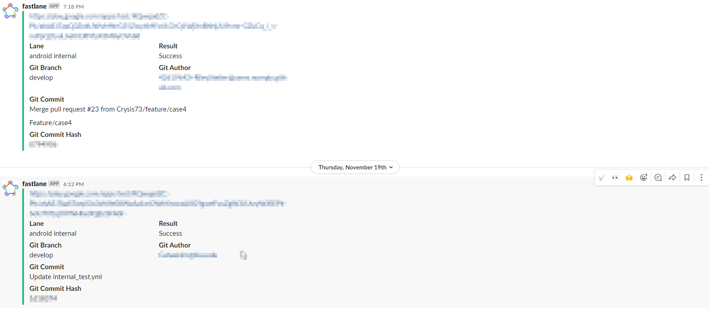
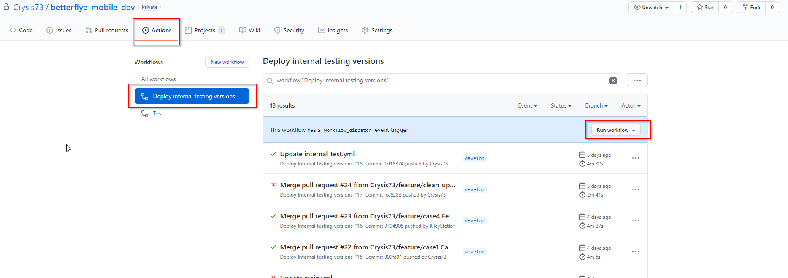

# Deployment Documentation

## CI/CD Deployments

The [betterflye_mobile_dev](https://github.com/Crysis73/betterflye_mobile_dev) repository has a CI/CD pipeline setup to deploy internal release versions to an Internal Testing Track on Google Play. iOS CI/CD will be available in later iterations.

A new release is deployed to the internal testing track every time a new case is merged into the main or develop branch. Once a workflow run has finished, the link to obtain the latest app version is posted to the `#mobile-dev-development-builds` channel in the Betterflye slack.

The Github Actions workflow can also be run manually from the [betterflye_mobile_dev repository](https://github.com/Crysis73/betterflye_mobile_dev).

## Manual Deployments

### Build and Release an Android App

The official Flutter documentation has steps on how to build and release an Android app [listed here](https://flutter.dev/docs/deployment/android).

### Build and Release an iOS App

The official Flutter documentation has steps on how to build and release an iOS app [listed here](https://flutter.dev/docs/deployment/ios)
