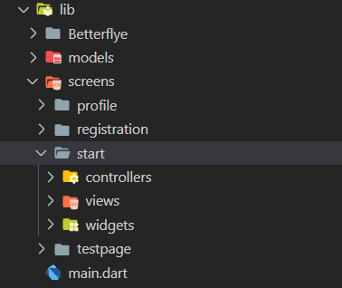

# Development Documentation

---

## Prerequisites

### Flutter Installation

Work through the [Get Started](https://flutter.dev/docs/get-started/install) section of the Flutter Documentation. This will walk you through installing flutter, installing either an Android or iOS emulator, and setting up Visual Studio Code as your editor.

You're finished once you can open Visual Studio Code, and launch an application on an Android or iOS Emulator.

### Docker Installation

Work through the [Get Docker](https://docs.docker.com/get-docker/) section of the Docker Documentation for your platform. This will walk you through installing Docker on your machine.

You're finished once you can run `docker` and `docker-compose` and see valid output.

### Betterflye Installation

You'll need access to two repositories to start working on Betterflye Mobile

- [Main Betterflye Repository](https://github.com/tms326/Betterflye.git)
- [Betterflye Mobile Repository](https://github.com/Crysis73/betterflye_mobile_dev)

Once you have access to these two repositories, run the following to clone them to your machine.

```bash
git clone https://github.com/tms326/Betterflye.git;
git clone https://github.com/Crysis73/betterflye_mobile_dev
```

The `betterflye_mobile_dev` repository contains the latest code for the Betterflye Mobile Application.

The `Betterflye` repository contains the latest code for the Betterflye web application. **WE RARELY TOUCH THIS REPOSITORY**

---

## Starting Development

### Create a case branch

The first thing you should do when starting to develop is create your own branch in the **betterflye_mobile_dev** repository.

If the case you are working on is a feature, your branch name should be `feature/case[insert-case-number]`. For instance, if you were working on case 10, your branch name should be `feature/case10`

If the case you are working on is a bug, your branch name should be `bug/case[insert-case-number]`. For instance, if you were working on case 14, your branch name should be `bug/case14`

You can create a branch by running:

```bash
git checkout -b [insert-branch-name-here]
```

This command will create a branch with whatever name you specify and switch you to it.

### Host the Betterflye Web Application Locally

The Betterflye Mobile application depends on an API that lives in the main Betterflye repository. Since we don't want to do pollute the production API (and database) with development data, we've created a `docker-compose` environment to host Betterflye locally.

**Start docker-compose environment**:

1. In a terminal, navigate to the directory where you cloned the main Betterflye repository.
2. Navigate to the `Docker` folder within the main Betterflye repository

    ```bash
    cd Docker
    ```

3. Start Betterflye

    ```bash
    docker-compose up
    ```

**Note**: The sql setup scripts can take a bit of time depending on the speed of your machine.

Your done once you can navigate to `localhost:9090` and create an account or login.

### Launch the Mobile Application

Now that you're on a [case branch](#create-a-case-branch) and [Betterflye is running locally](#host-the-betterflye-web-application-locally), navigate to the betterflye_mobile_dev repository and launch Visual Studio Code.

**To start an emulator running Betterflye**:

1. Open `main.dart`
2. Click the run button in the top right corner of the screen

    

3. In the pop-up menu, either create a new emulator or select an existing one

    

4. Once your emulator is up and running, you're good to go

    

---

## Design Pattern

We decided to follow the [WidgetView design pattern in Flutter](https://blog.gskinner.com/archives/2020/02/flutter-widgetview-a-simple-separation-of-layout-and-logic.html) which is simply a modified version of the [MVVM](https://docs.microsoft.com/en-us/xamarin/xamarin-forms/enterprise-application-patterns/mvvm#the-mvvm-pattern) design pattern for Flutter. The WidgetView design pattern allows us to achieve simple separation of concerns in Flutter.

The WidgetView pattern has four components:

1. Widgets
2. WidgetStates (for stateful widgets)
3. WidgetViews
4. Models

### Widgets

Flutter widgets are explained in depth in the [Write Your First App](https://flutter.dev/docs/get-started/codelab#step-1-create-the-starter-flutter-app) tutorial in Flutter.

### WidgetStates

For custom, complex, stateful widgets, we've separated the State object (you can think of this as a controller) into its own class. All business and application logic for the Widget is stored in the WidgetState class which the view has a reference to.

### WidgetViews

As you might expect, the WidgetView is a class that **strictly** contains the view and any view logic for a Widget. If an element of the view is the trigger for a business logic function, the view accesses the WidgetState, and calls the function that lives in the WidgetState.

### Models

A Model class is a **non-visual** class that purely contains data that needs to be distributed to multiple widgets within the application. Model classes are read and and updated by WidgetStates via a Flutter state management solution called Provider.

[More on State Management and Provider here](https://flutter.dev/docs/development/data-and-backend/state-mgmt)

---

## Folder Structure



In Flutter, the application logic is in the is all in the `lib` folder.

From there, we have a Betterflye folder which will contain any static files needed to hold constants used across the application.

Next is the models folder, which contains all the Models used in the application.

Afterwards is the screens folder, which contains a subfolder for each screen that is currently viewable within the application.

Each screen is broken down into [controllers (states)](#widgetstates), [views](#widgetviews), and [widgets](#widgets) that make up that screen.

The main.dart file is the entry point for our application.

---

## Testing

The betterflye_mobile_dev repository features a suite of automated tests.

### Run Tests

To run our automated test suite, in the root directory of the repository, run:

```bash
flutter test --coverage
```

**Sample output**:

```bash
PS D:\school\betterflye_mobile_dev> flutter test --coverage
00:11 +5: All tests passed!
PS D:\school\betterflye_mobile_dev>
```

Automated tests are also automatically run on every pull request that is submitted to the develop branch on the repository. A coverage report is automatically published on the pull request too.


---