# Betterflye Mobile User Documentation

Currently using the Betterflye Mobile application users are able to:

1. [Create an account on the Betterflye platform](#create-an-account)
2. [Login using their created credentials](#login-to-your-account)
3. [See their unique user QR Code, which allows initiative managers to check them in and out of an initiative shift when scanned](#view-your-qr-code)
4. [Check theirself into an initiative shift by scanning the initiative's QR code.](#check-yourself-into-an-initiative-shift)
5. [View their profile page](#view-your-profile-page)
6. [View their schedule page](#view-your-schedule-page)
7. [View initiatives they manage from the Betterflye platform](#view-initiatives-you-manage)
8. [Scan another user's QR code to check them in or out of an initiative](#check-a-user-in-or-out-of-an-initiative-shift)
9. [Log out of their account](#logout-of-your-account)

## Create An Account

To create an account, after opening the application, press the sign up button. You'll be directed to a screen where you can enter in your first name, your last name, and tick a checkbox confirming that you are at least 13 years old.

After entering in the above information, press the next button, and you'll be directed to a page where you can enter in your username, email, and password. Once you've finished entering in that information, click "Create Account"!

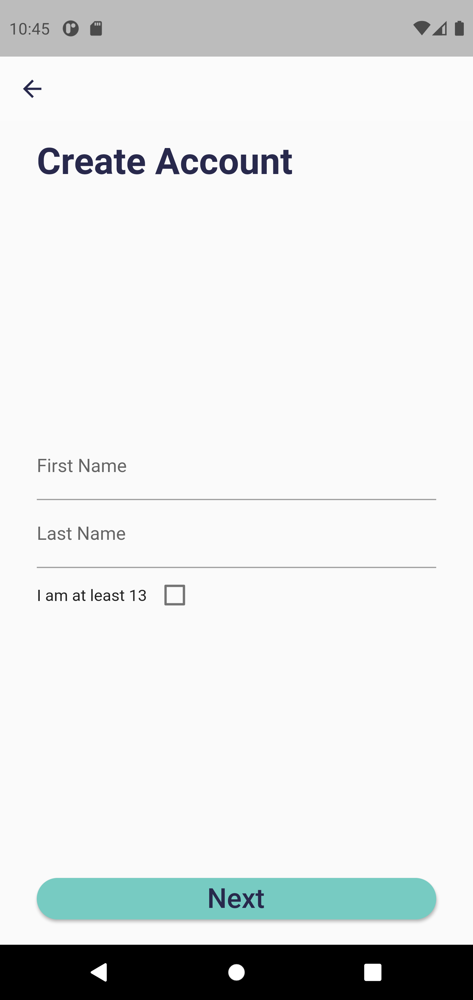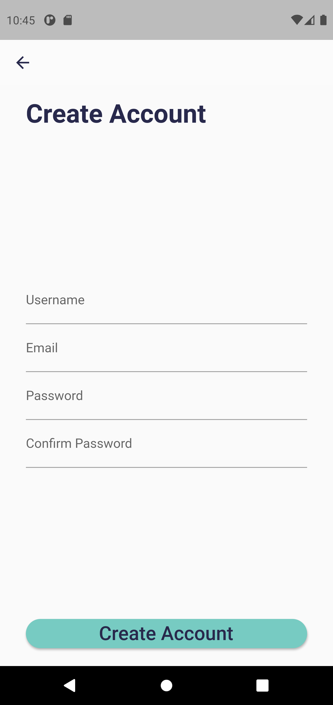

## Login to your Account

To login to your account, after opening the application, press the login button. You'll be directed to a page where you can enter in your username and password. Once you've entered in your username and password, if your username and password are correct, you'll be directed to your profile page!

## View your QR Code

Directly after logging in to the application, you will be directed to your QR code page. This QR code contains your unique profile url, which will direct someone to your profile page on the Betterflye website if they scan your QR code. If you navigate away from this page, you can get back to it by pressing the "Your Qr Code" button on the bottom navigation bar.

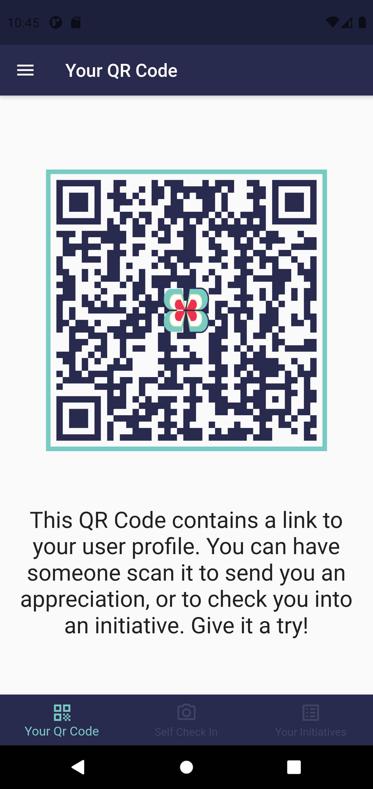

## Check Yourself Into an Initiative Shift

*Note: A user must have already registered for a shift on the Betterflye website in order to check in for that shift.*

*Note: If Betterflye does not have camera access on your phone, you will be notified when you try to scan a QR code and directed to your settings to allow access.*

To check yourself into an initiative shift, press the "Self Check In" button on the bottom navigation bar. Next, press the "Check In/Out" button on that page which opens up your phone's camera, where you then must scan the initiative QR code provided by the initiative manager. If the scanning fails, you will be alerted afterward.

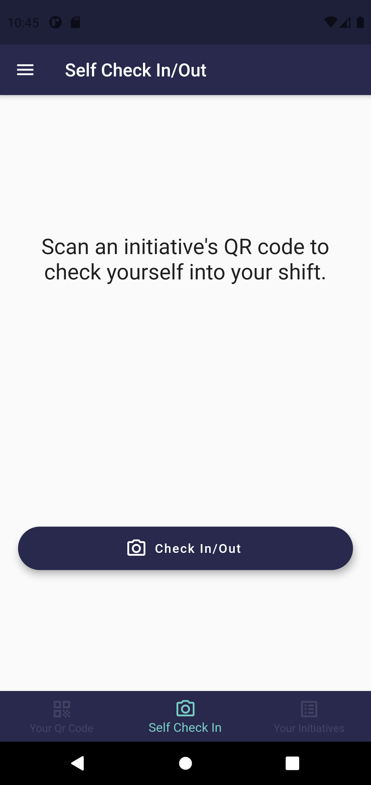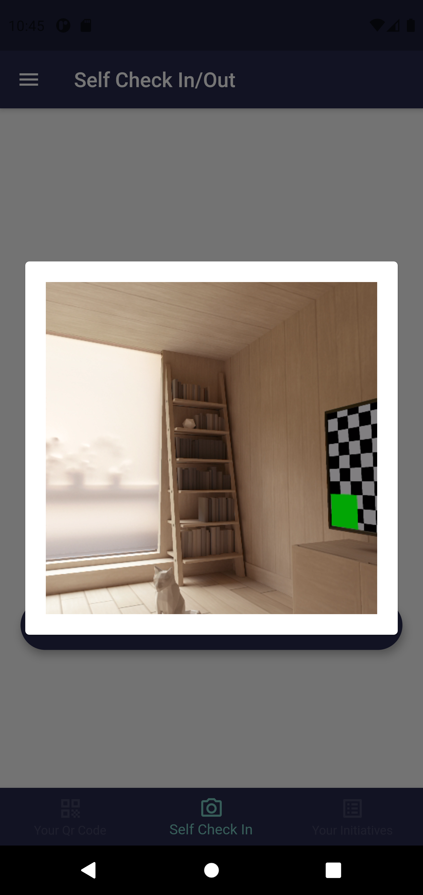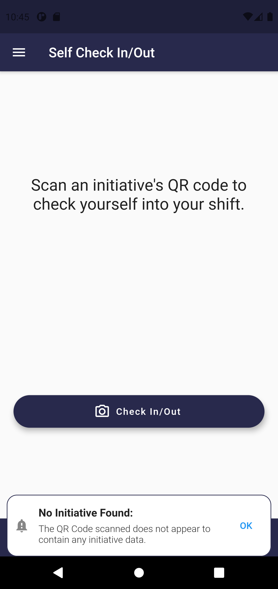

## View your Profile Page

By first opening the drawer from any page accessible from the bottom navigation bar, you can press the "Profile Page" button within the drawer to view your profile page. This page contains your first and last name, along with your impact score, current volunteer hours, and total amount of money donated.

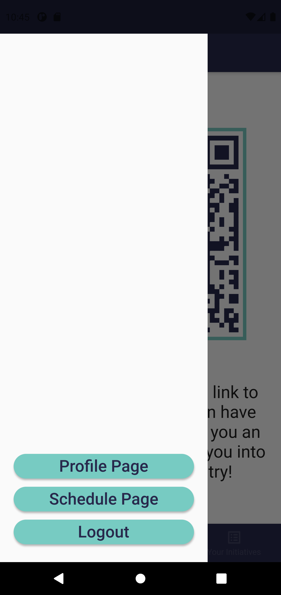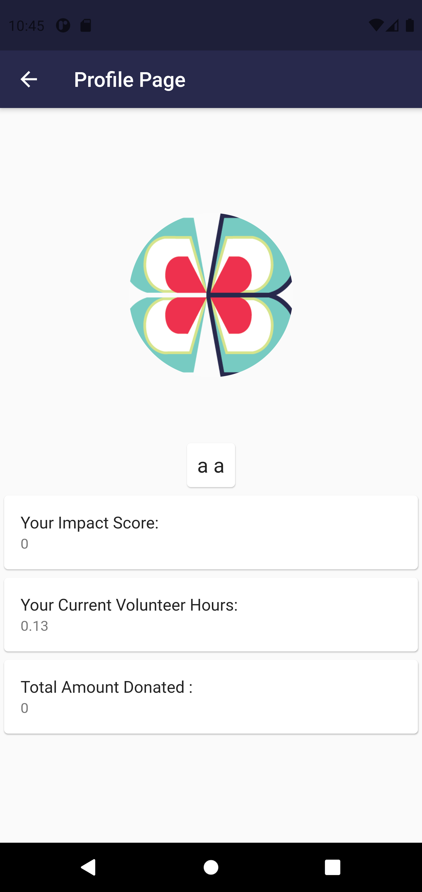

## View your Schedule Page

By first opening the drawer from any page accessible from the bottom navigation bar, you can press the "Schedule Page" button within the drawer to view your schedule page. You can view your upcoming shifts you have already registered for on the Betterflye website by tapping the "Upcoming" tab, or view your past shifts that you have already completed by tapping the "All" tab near the top of the page.

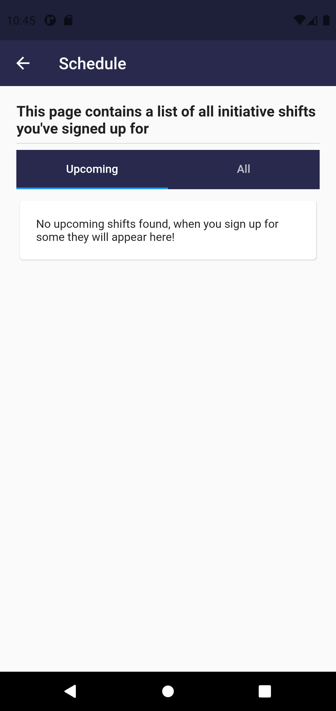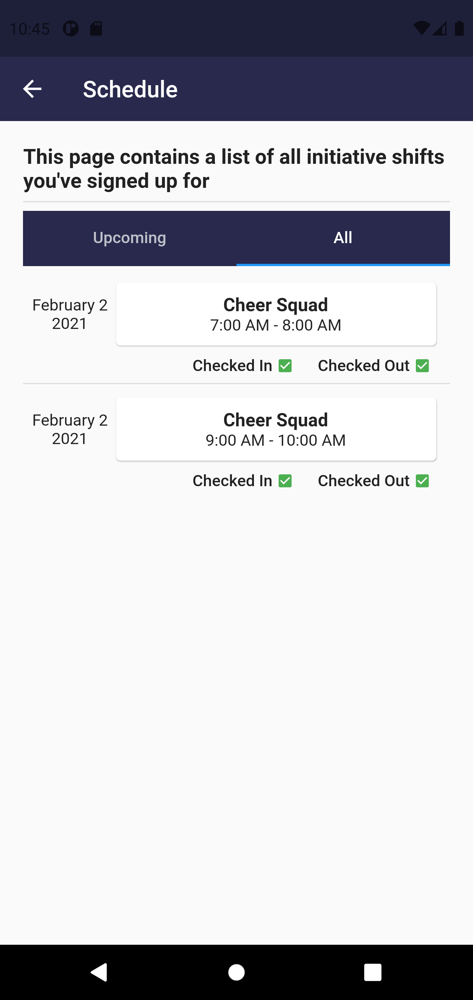

## View Initiatives You Manage

After pressing the "Your Initiatives" button on the bottom navigation bar, you are directed to a page where you see a list of initiatives from the Betterflye platform that you manage. If you do not manage any, none will show up.

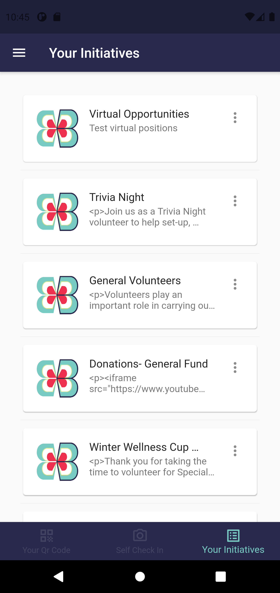

## Check a User In or Out of an Initiative Shift

*Note: A user must have already registered for a shift on the Betterflye website in order to check in for that shift.*

*Note: If Betterflye does not have camera access on your phone, you will be notified when you try to scan a QR code and directed to your settings to allow access.*

From the initiative list seen above, you can click on any initiative to see a list of shifts for that initiative. Next, you press the "Check In/Out" button, and scan the user's QR code to check them in if they need checked in, or it checks them out if they are already checked in. If the user has already logged their shift, you will be notified.

Or, if you for some reason can not scan a user's QR code to check them in or out, you can just tap on their shift to check them in or out.

By pressing the "QR Code" tab at the top of the initiative shift page, you will see the QR code for this initiative. Those wishing to self check-in will need to scan this QR code.

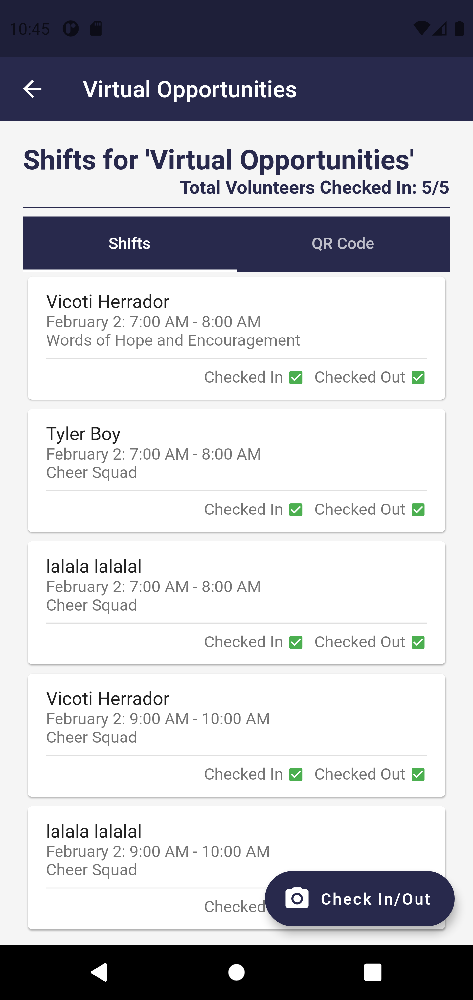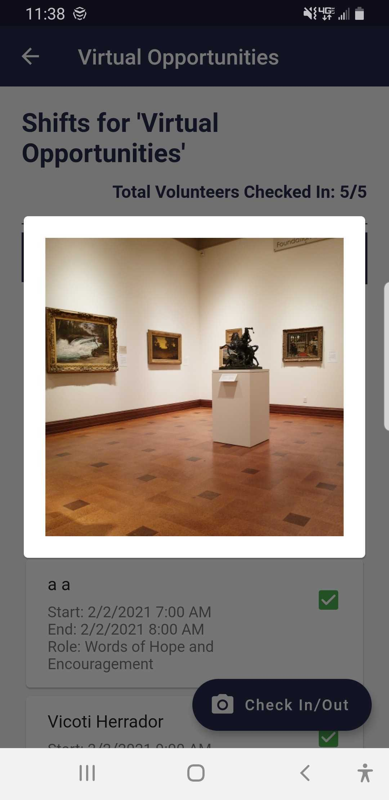

## Logout of your Account

From any page accessed from the bottom navigation bar, you can press the drawer button located in the top left of the screen, which opens the drawer containing the "Logout" button. By pressing the logout button, you will be logged out of your account and returned to the start page.

